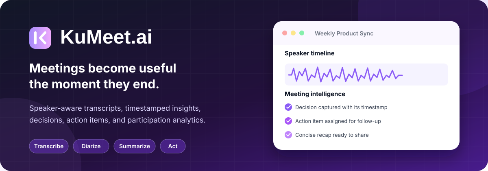
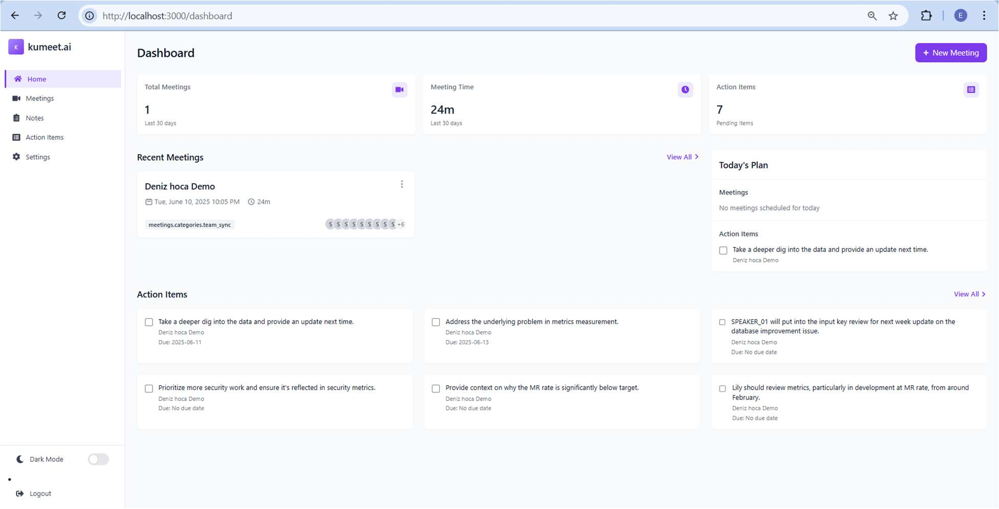
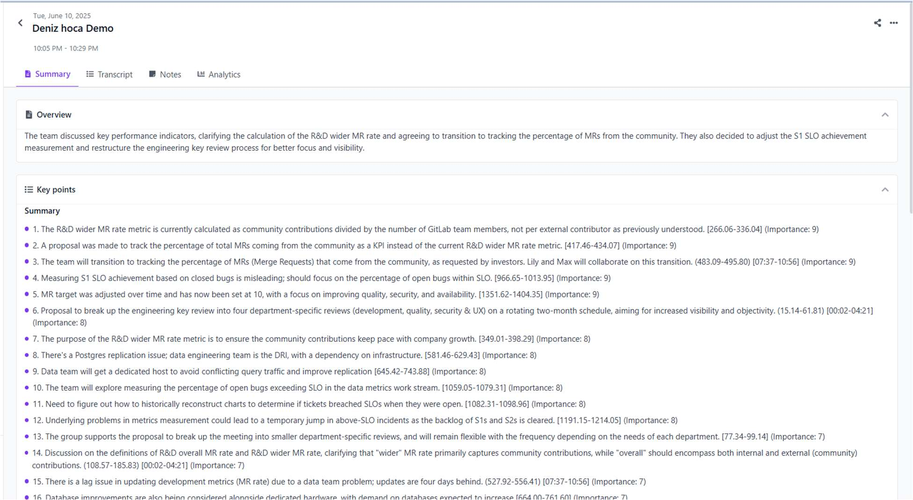
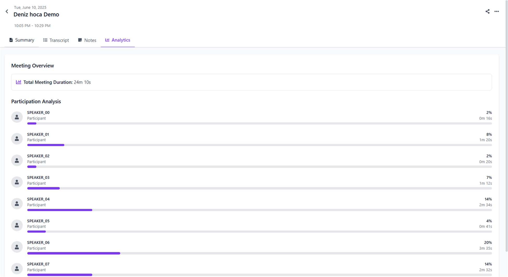
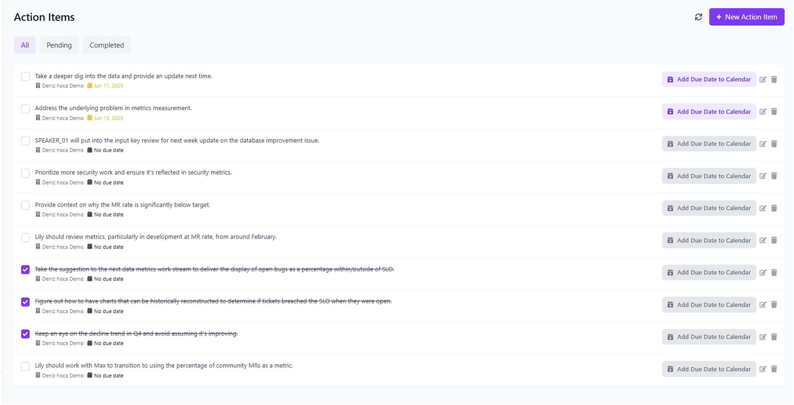
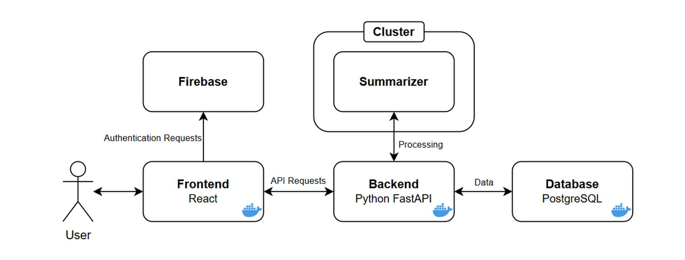
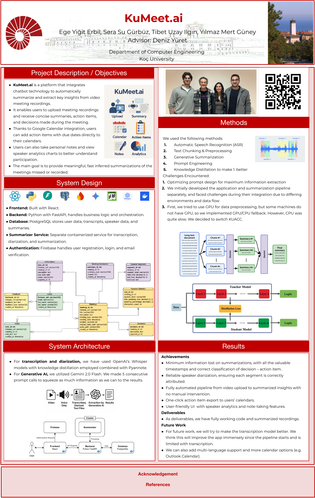

  

<h1 align="center">KuMeet.ai</h1>

  <strong>An AI meeting assistant that turns recordings into speaker-aware transcripts, concise recaps, decisions, and action items.</strong>

  
  
  
  
  
  

KuMeet.ai was built to solve a familiar problem: the meeting ends, but the useful information is still buried inside the recording. Upload an audio or video file and the system organizes it into a timestamped transcript, a structured summary, decisions, follow-up tasks, personal notes, and speaker participation insights.

Developed at Koç University for the COMP 491 Computer Engineering Design Project, KuMeet.ai combines a polished web application with a multi-stage speech and language pipeline.

  
   
  The KuMeet.ai dashboard from the final senior-design demonstration.

> [!NOTE]
> This public release candidate preserves the final senior-design application while removing private credentials, generated data, and institution-specific defaults. AI processing is disabled by default; the original demonstration used Koç University's private KUACC/Slurm GPU infrastructure.

## What KuMeet.ai does

| | |
|---|---|
| **Recording in, structured meeting out** Upload common audio or video formats, choose the meeting context, and optionally ask the pipeline to focus on a specific question. | **Speaker-aware transcription** Pyannote separates speakers while Faster-Whisper produces timestamped transcript segments. |
| **Layered meeting intelligence** Multi-stage prompts produce an overview, ranked key points, decisions, and action items while preserving useful timestamps. | **Follow-up workspace** Review pending and completed tasks, attach due dates, and keep meeting-specific or personal notes. |
| **Participation analytics** See speaker labels, speaking-time totals, and participation share for a quick view of meeting dynamics. | **A complete application shell** Firebase authentication, email verification, profile controls, dark mode, and a localized interface in English, Turkish, Spanish, German, French, and Italian. |

The final Senior Design Day build also demonstrated one-click export of dated action items to Google Calendar.

## Product tour

<table>
  <tr>
    <td width="50%" valign="top">
      
       
      <strong>Meeting intelligence.</strong> An overview and importance-ranked, timestamped key points.
    </td>
    <td width="50%" valign="top">
      
       
      <strong>Speaker analytics.</strong> Participation is broken down by speaker and duration.
    </td>
  </tr>
  <tr>
    <td colspan="2" valign="top">
      
       
      <strong>From insight to follow-up.</strong> Track, complete, edit, and schedule the tasks extracted from a meeting.
    </td>
  </tr>
</table>

## From recording to follow-up

~~~mermaid
flowchart LR
    A["Audio / video"] --> B["Media preparation"]
    B --> C["Speaker diarization"]
    C --> D["Speech-to-text"]
    D --> E["Multi-stage summarization"]
    E --> F["Recap + decisions + actions"]
    F --> G["Web workspace"]

    classDef input fill:#ede9fe,stroke:#7c3aed,color:#2e1065;
    classDef process fill:#faf5ff,stroke:#a855f7,color:#3b0764;
    classDef output fill:#f5f3ff,stroke:#8b5cf6,color:#2e1065;
    class A input;
    class B,C,D,E process;
    class F,G output;
~~~

1. **Ingest** — Accept a meeting recording and normalize its audio with FFmpeg/MoviePy.
2. **Separate** — Detect speaker turns with Pyannote diarization.
3. **Transcribe** — Convert each speaker segment to text with Faster-Whisper.
4. **Understand** — Use Gemini 2.0 Flash and chained prompts to extract a recap, key points, decisions, action items, importance scores, and focused answers.
5. **Organize** — Persist results and present them through the FastAPI and React application.

## Architecture

  

The React client communicates with a FastAPI backend; Firebase provides identity, and PostgreSQL stores users, meetings, transcripts, summaries, notes, decisions, action items, and speaker statistics. For the final demonstration, the backend transferred recordings to a KUACC worker, submitted a Slurm GPU job, and retrieved the processed result for storage and display.

| Layer | Technology | Responsibility |
|---|---|---|
| Web client | React 18, React Router, Tailwind CSS, i18next | Dashboard, upload flow, meeting views, notes, tasks, settings, localization |
| API | Python 3.10, FastAPI, Uvicorn, Pydantic | Authentication-aware routes, meeting orchestration, persistence, feedback |
| Data and identity | PostgreSQL 14, Firebase Authentication/Admin | Application data, user identity, sessions, email verification |
| Media and speech | FFmpeg/MoviePy, Pyannote, Faster-Whisper, PyTorch | Audio conversion, speaker diarization, transcription |
| Language pipeline | Gemini 2.0 Flash, prompt chaining | Summaries, decisions, action items, importance ranking, focused Q&A |
| Infrastructure | Docker Compose, KUACC, Slurm | Local web stack and the original GPU-backed processing workflow |

## Repository map

~~~text
.
├── frontend/        React application
├── backend/         FastAPI service and PostgreSQL models
├── worker/          Optional diarization, transcription, and NLP worker
├── docs/assets/     README artwork and product screenshots
├── scripts/         Pre-publication file and secret-pattern check
├── .env.example     Safe configuration template
├── docker-compose.yml
├── PUBLISHING.md    Clean-repository and existing-fork workflows
├── SECURITY.md      Credential and meeting-data policy
└── README.md
~~~

The release is flattened around the final frontend and backend. The optional worker is included for reproducibility, but no model token, SSH key, Firebase Admin credential, meeting recording, or generated database is bundled.

## Explore the development stack

### Prerequisites

- Docker Engine or Docker Desktop with Docker Compose
- A Firebase project with a web application for the React login flow
- A Firebase Admin service account for authenticated backend use

### Start the web, API, and database services

1. Copy <code>.env.example</code> to <code>.env</code.
2. Set a new PostgreSQL password and fill the <code>REACT_APP_FIREBASE_*</code> values from your own Firebase web application.
3. Keep <code>PROCESSING_MODE=disabled</code> unless you have configured your own worker host.
4. From the repository root, run:

~~~bash
docker compose up --build
~~~

Once the containers are healthy:

- Web application: <http://localhost:3000>
- FastAPI: <http://localhost:8000>
- Interactive API documentation: <http://localhost:8000/docs>
- PostgreSQL: <code>localhost:5432</code>

Stop the stack with:

~~~bash
docker compose down
~~~

> [!IMPORTANT]
> The base Compose file enables explicit Firebase development mode so the backend can start without a bundled Admin credential. This is only for local interface work. For authenticated use, keep your service-account file outside the repository, set <code>FIREBASE_CREDENTIALS_FILE</code> to its absolute path, and add the safe runtime mount:

~~~bash
docker compose -f docker-compose.yml -f docker-compose.firebase.yml up --build
~~~

### Optional cluster processing

The public backend contains an opt-in cluster adapter with strict host-key checking, runtime-only SSH mounts, configurable Slurm settings, and a job timeout. To use it:

1. Copy <code>docker-compose.cluster.example.yml</code> to <code>docker-compose.cluster.yml</code>.
2. Set the required <code>CLUSTER_*</code> and, where needed, <code>SLURM_*</code> variables locally.
3. Keep the SSH private key and <code>known_hosts</code> file outside the repository.
4. Configure <code>HF_TOKEN</code> and <code>GEMINI_API_KEY</code> on the worker host, not in this repository.
5. Add the cluster override to the Compose command.

The default stack deliberately does not recreate the original private KUACC deployment.

## Credentials and meeting data

Meeting recordings and transcripts can contain sensitive information. Use environment variables or a secret manager for model tokens and deployment credentials; never commit Firebase Admin JSON files, SSH private keys, API keys, meeting media, or generated databases. Rotate any credential that has ever appeared in a working copy before publishing or deploying it. See [SECURITY.md](SECURITY.md) for the release policy.

Before pushing, follow [PUBLISHING.md](PUBLISHING.md). It includes the
pre-publication check, the recommended clean-repository workflow, and a
separate path for updating an existing fork without accidentally copying the
archived folders.

## Senior design project

Built during Spring 2025 at the Koç University Department of Computer Engineering.

<table>
  <tr>
    <td width="25%" align="center"><strong>Ege Yiğit Erbil</strong></td>
    <td width="25%" align="center"><strong>Sera Su Gürbüz</strong></td>
    <td width="25%" align="center"><strong>Tibet Uzay Ilgın</strong></td>
    <td width="25%" align="center"><strong>Yılmaz Mert Güney</strong></td>
  </tr>
</table>

**Project advisor:** Deniz Yüret

  
<strong>View the original Senior Design Day poster</strong>

   
  

    
  

  
The external QR campaign printed on the original poster has since expired.

## Acknowledgements

We thank our project advisor, Deniz Yüret, the Koç University Department of Computer Engineering, and the KUACC team for the guidance and computing infrastructure that supported the final prototype.
